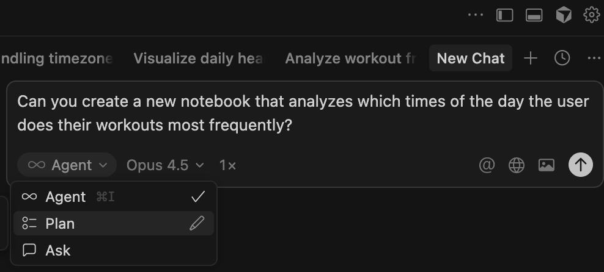

# BIOS-226-2025: HealthKit Data Analysis

Lecture on analyzing your own digital health data.

## Prerequisites (Optional)

If you don't already have Python and Git installed, follow the instructions below for your operating system.

### macOS

#### Installing Python

macOS comes with Python 2 pre-installed, but you'll need Python 3. The recommended approach is using Homebrew:

1. First, install Homebrew (if not already installed) by opening Terminal and running:
```bash
/bin/bash -c "$(curl -fsSL https://raw.githubusercontent.com/Homebrew/install/HEAD/install.sh)"
```

2. Install Python 3:
```bash
brew install python3
```

3. Verify the installation:
```bash
python3 --version
```

Alternatively, download the installer directly from [python.org/downloads](https://www.python.org/downloads/).

#### Installing Git

Git can be installed via Xcode Command Line Tools (simplest) or Homebrew:

**Option 1 - Xcode Command Line Tools:**
```bash
xcode-select --install
```

**Option 2 - Homebrew:**
```bash
brew install git
```

Verify the installation:
```bash
git --version
```

### Windows

#### Installing Python

Download the latest Python installer from [python.org/downloads/windows](https://www.python.org/downloads/windows/). Run the installer and **check the box "Add python.exe to PATH"** before proceeding—this is critical as it allows you to run Python from any command prompt or terminal. You can then click "Install Now" for a default installation.

After installation completes, verify it by opening PowerShell or Command Prompt and typing:
```bash
python --version
```

#### Installing Git

Download the latest Git for Windows installer from [git-scm.com/download/win](https://git-scm.com/download/win) (the download will start automatically). Run the installer and follow the Git Setup wizard, accepting the default options unless you have specific preferences. During installation, ensure you select "Git from the command line and also from 3rd-party software" for the PATH environment option.

Once installed, verify by opening Command Prompt, PowerShell, or Git Bash and typing:
```bash
git --version
```

## Installing Cursor

Cursor is an AI-powered code editor that we'll use for this course.

### Get the 1-year Free Subscription for Students
Go to [cursor.com](https://cursor.com/students) and apply for the student 1-year free Pro subscription if you haven't already.

### macOS
1. Go to [cursor.com](https://www.cursor.com/)
2. Click **Download for macOS**
3. Open the downloaded `.dmg` file
4. Drag Cursor to your Applications folder
5. Launch Cursor from Applications

### Windows
1. Go to [cursor.com](https://www.cursor.com/)
2. Click **Download** and select the Windows installer
3. Run the downloaded `.exe` installer
4. Follow the installation prompts
5. Launch Cursor from the Start menu

## Setup

1. Create a virtual environment:
```bash
python3 -m venv venv
source venv/bin/activate  # On macOS/Linux
# venv\Scripts\activate # On Windows

```

2. Install dependencies:
```bash
pip install -r requirements.txt
```

## Exporting Your Own Apple Health Data (Option 1)
See `HealthKit_export_instructions.pdf` for a detailed visual guide.

1. Open the **Health** app on your iPhone
2. Tap your profile picture (top right)
3. Scroll down and tap **Export All Health Data**
4. Transfer the exported ZIP to your computer
5. Unzip and place `export.xml` in the `data/` folder (rename to `raw_health_export.xml`)

## Using a Publicly Available HealthKit Export (Option 2)
1. Download here the `.xml` file [here](https://drive.google.com/file/d/1PbhUQCUEEcavK4NkVD_aUWft0jN--j4B/view?usp=share_link) 
2. Put the downloaded file in the `data` directory contained in this folder.

## Usage

### Extract Data to CSV

```bash
python extract_healthkit.py data/raw_health_export.xml --output data/
```

Options:
- `--output, -o`: Output directory (default: current directory)
- `--types, -t`: Extract specific types: `records`, `workouts`, `activity`

Examples:
```bash
# Extract only health records
python extract_healthkit.py data/raw_health_export.xml -o data/ --types records

# Extract workouts and activity summaries
python extract_healthkit.py data/raw_health_export.xml -o data/ --types workouts activity
```

### Output Files

| File | Description |
|------|-------------|
| `health_records.csv` | All health metrics (steps, heart rate, energy, etc.) |
| `workouts.csv` | Workout sessions with duration, distance, calories |
| `activity_summary.csv` | Daily activity ring data (Move, Exercise, Stand) |

### Loading in Python

```python
import pandas as pd

# Load health records
records = pd.read_csv('data/health_records.csv')

# Filter by type
steps = records[records['type'] == 'HKQuantityTypeIdentifierStepCount']
heart_rate = records[records['type'] == 'HKQuantityTypeIdentifierHeartRate']

# Load workouts
workouts = pd.read_csv('data/workouts.csv')

# Load activity rings
activity = pd.read_csv('data/activity_summary.csv')
```

## Data Types

Common record types in the export:
- `HKQuantityTypeIdentifierStepCount` - Step count
- `HKQuantityTypeIdentifierHeartRate` - Heart rate (bpm)
- `HKQuantityTypeIdentifierActiveEnergyBurned` - Active calories
- `HKQuantityTypeIdentifierDistanceWalkingRunning` - Distance
- `HKQuantityTypeIdentifierBasalEnergyBurned` - Resting calories
- `HKQuantityTypeIdentifierFlightsClimbed` - Floors climbed
- `HKCategoryTypeIdentifierSleepAnalysis` - Sleep data


## First Set of Questions to Answer:
Try to answer these basic questions using the publicly available healthkit export you downloaded.

1. What time of the day does the user do most workouts?

2. Which day of the week does the user have most steps?

3. Between daily Apple Exercise Time, HRV, Steps, Active Energy and Average Heart Rate, which variable pair has the highest correlation (linear)


### Using Cursor to answer the questions:
While you are free to do this manually, AI coding agents have become so powerful, you can literally just ask the question and with some back and forth get a first answer (maybe not the correct one though hahaha)

#### Ask the question in Cursor

`Question: Can you create a new notebook that analyzes which times of the day the user does their workouts most frequently?`

Set the `mode` from Agent to Plan and select a strong model (e.g. Opus 4.5) 

##### Set Plan Mode


##### Set the Model


## More advanced: lets try to analyze causality
In the notebook `var_analysis.ipynb` you will find a first exploratory analysis to apply a method for predictive causality. Start having a look and see whether we could do the same with other variables instead of the ones used.